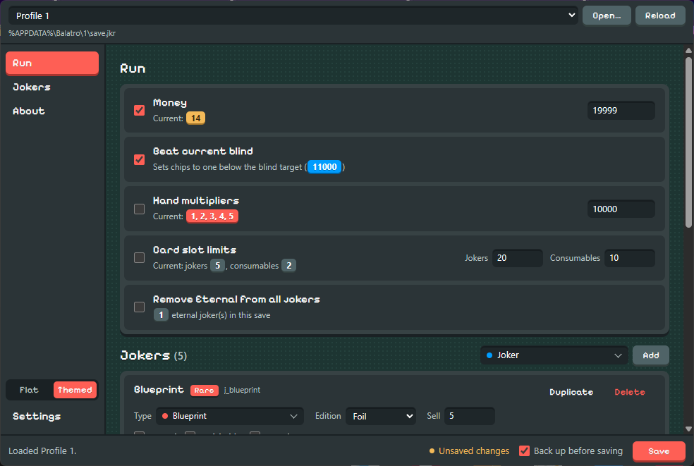

# Balatro Save Editor

A free desktop save editor for [Balatro](https://www.playbalatro.com/). Change your money, beat the current blind, set hand mult, raise joker and consumable slots, and edit jokers (type, edition, stickers, sell value) in your `save.jkr`. Runs on Windows, macOS (Apple Silicon) and Linux.

**[Download](https://github.com/BurntToasters/balatro-save-editor-gui/releases/latest)** · **[Website](https://bse.burnttoasters.com/)**

This app was made possible by the CLI code created by [problemsalved](https://github.com/problemsalved/balatro_save_editor). Thank you!!



Forked from [problemsalved/balatro_save_editor](https://github.com/problemsalved/balatro_save_editor) the original command-line editor and wrapped in a [pywebview](https://pywebview.flowrl.com/) GUI. The Python parser (raw-deflate `zlib` + byte-exact recompression validation) is reused unchanged.

## Features

The editor auto-detects your Balatro save and lets you toggle any of these changes, then writes them back (creating a `.bak` backup first):

- **Money** – set your dollars to any value
- **Beat current blind** – set chips to one below the current blind target
- **Hand multipliers** – set the multiplier for every poker hand
- **Card slot limits** – raise joker and consumable slot counts
- **Remove "eternal"** – strip the eternal sticker from jokers
- **Joker Editing** - Add/Remove/Modify jokers and their enhancements
- **Themed or Flat UI** - a Balatro-style look (default) or a plain native one; switch at the bottom of the sidebar. Settings live in `settings.json` in your app-data folder (`%APPDATA%\Balatro Save Editor`, `~/Library/Application Support/Balatro Save Editor`, or `~/.config/balatro-save-editor`) and can be reset from **Settings**.
- **Update check** - on launch (can be turned off) or from **Settings → Check now**, compares your version with the latest GitHub release and offers to open the download page. Nothing is downloaded automatically.

## Supported platforms

| OS | Installer | Save location |
| --- | --- | --- |
| Windows x64 | `.exe` (NSIS) | `%APPDATA%\Balatro\<profile>\save.jkr` |
| macOS (Apple Silicon) | `.dmg` | `~/Library/Application Support/Balatro/<profile>/save.jkr` |
| Linux x64 | `.AppImage` | Steam Proton prefix (`compatdata/2379780/...`) |

If a save isn't found automatically, use **Open…** to pick the file manually.

## Development

Requires Python 3.14+ and Node 24+.

```bash
npm run venv      # create .venv and install Python deps
npm run dev       # launch the app from source
npm test          # run the pytest suite
npm run smoke:gui # drive the real window against a temp save
npm run e2e       # every end-to-end suite; reports + screenshots in e2e-artifacts/
```

`npm run e2e` covers save safety, the real window, the Windows installer (install, upgrade,
uninstall; needs NSIS, `makensis` on PATH or `MAKENSIS=<path>`) and GPG signing with a throwaway
key. What each check guards against is listed in
[build-scripts/e2e/FAILURE_MODES.md](build-scripts/e2e/FAILURE_MODES.md).

The website lives in `docs/` (GitHub Pages). Its domain comes from `docs/CNAME`:

```bash
npm run site:sync    # point canonical/og/sitemap/robots/README links at the CNAME domain
npm run site:card    # re-render docs/img/social.png (share image) with headless Chrome/Edge
npm run test:scripts # includes a check that docs/ matches docs/CNAME
```

## Building

PyInstaller produces a standalone app for the platform you run it on (it cannot cross-compile, so build each target on its own machine).

```bash
npm run build         # PyInstaller bundle -> dist/
npm run smoke:runtime # launch the built app to confirm it starts
npm run dist          # wrap into the platform installer -> release/
```

## Releasing

See [RELEASING.md](RELEASING.md) for the signed, notarized, published release flow.

## Safety

Every write creates a timestamped `.bak` next to the save (the 10 newest are kept). The new file is written beside the save and swapped in, so a crash mid-save leaves the old one intact. After writing, the file is reloaded and re-validated (decompress → reparse → recompress must match), so a corrupt write is caught immediately. Editing save files is unsupported by the game; back up your saves.

## License

This project is licensed [MPL-2.0](LICENSE).

The save-parsing core is derived from [problemsalved/balatro_save_editor](https://github.com/problemsalved/balatro_save_editor) (the upstream repo has no separate license file; included with attribution to the original author).

Bundled third-party components (CPython, pywebview, pyobjc, etc.) and their licenses are listed in-app under the **Licenses** button, and written to `THIRD_PARTY_NOTICES.txt` on each build (`npm run licenses`).
